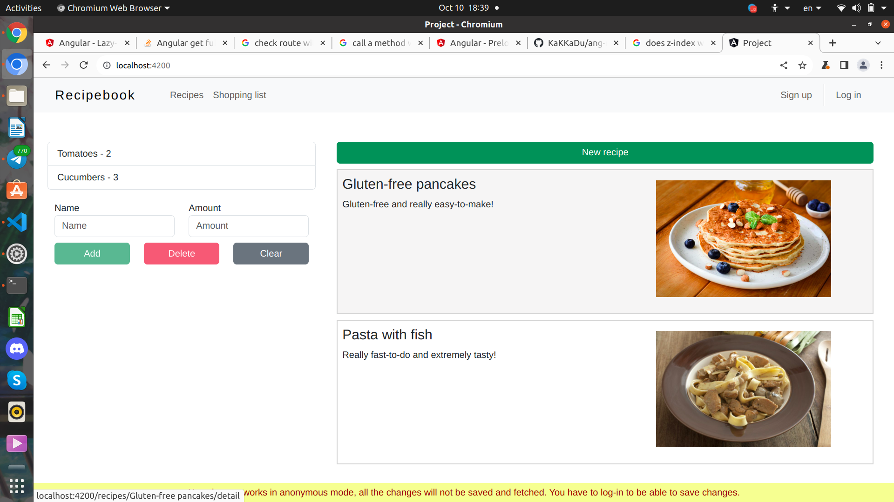
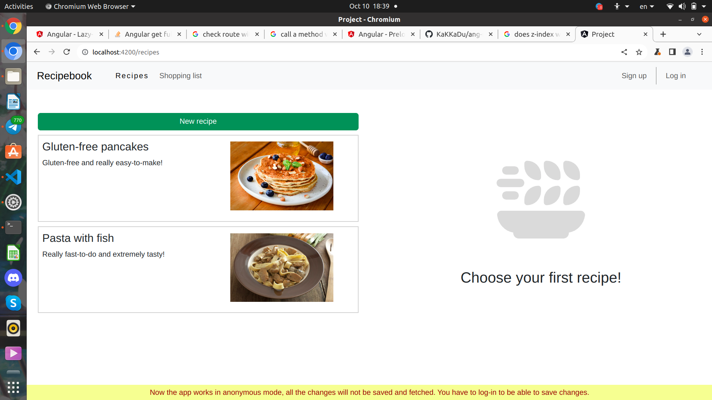
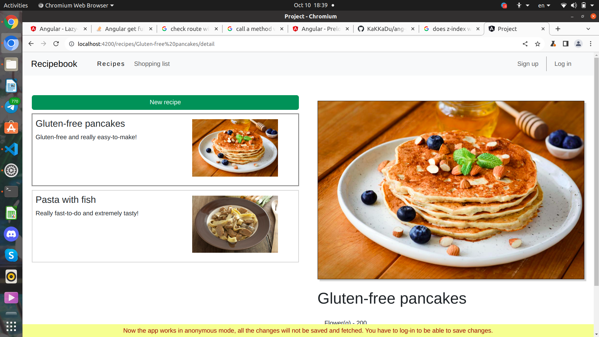
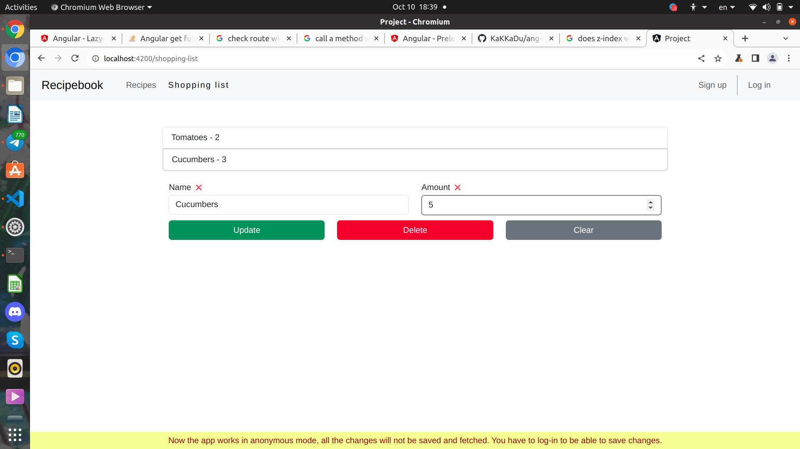
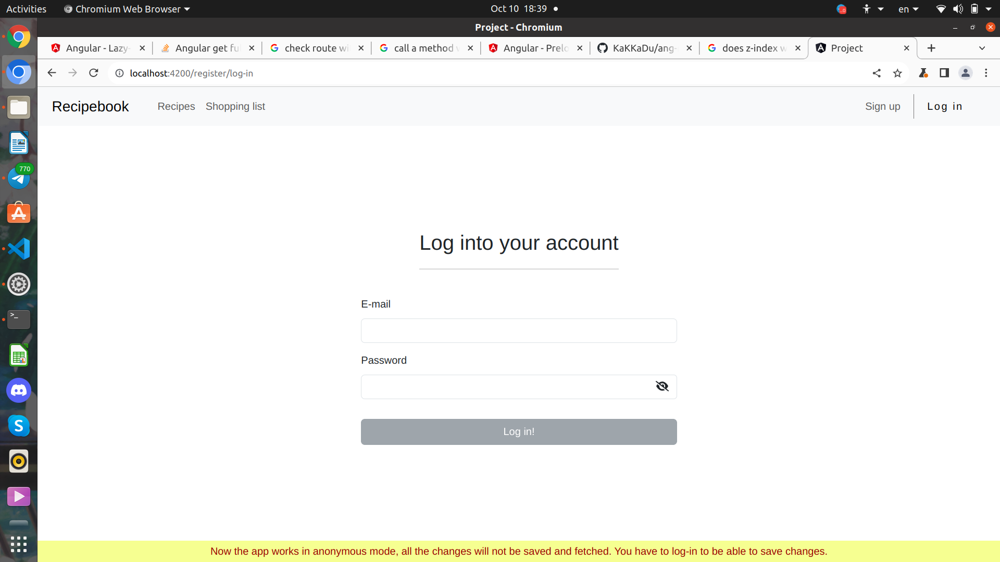
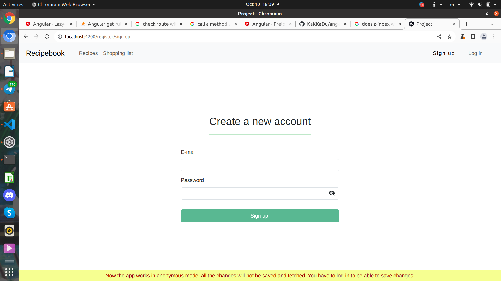

# A little about this project
Actually, this Angular app contains everything, that I know about Angular and it's features. That's just an evidence of my diligent work and of the fact, that this work is quite productive
P.S. That's not a CSS project, so all the styling is pretty mediocre, I didn't spend a lot of time to make it look cool. That's exactly Angular project, so be patient and look on what you see :3

## What have I learnt
I covered all the basics, including concept of front-end frameworks, **components, services, modules, directives, guards, routing** and **lazy-loading**. I also included **Firebase** feature there and briefly touched the **Observables** topic (which I'ma research right after end of the basic course). And all this stuff IS in this project (except Guards, in my concept they-re not needed here).

## About the actual app
Idea of this application is quite simple: that's a recipe book, with all basic things needed to work with that. It has **home** page, which contains a little shortened versions of the main features: **shopping-list** and **recipes-list**. You can get there by clicking on the brand/logo of the app: **Recipebook**. There are also two links with features described above. You can freely play around with them, deleting and adding Ingredients and recipes, editing them and saving. I have a file called **test-accounts-passwords.txt**,  which contains few accounts to **log-in**, because without that changes wouldn't be saved. Actually, new user doesn't get a new database to save exactly his recipes, and logging in just give you an opportunity to change something and save the common list to database. The logging-in feature was added to implement my knowledge about Firebase library, also to make changes in the app 'saveable'. There are also an option of creating **new account and logging out**,  implemented to the right side of the navbar.

# Technical part: how to make this code work
To make this work on your local machine, you have to save this files and set up **CLI**. After that you have to start compiling this project on localhost. Now that is the only approach, but I think I'm going to deploy this project on some free server soon, to make it easier to reach.       

## Few screenshots

